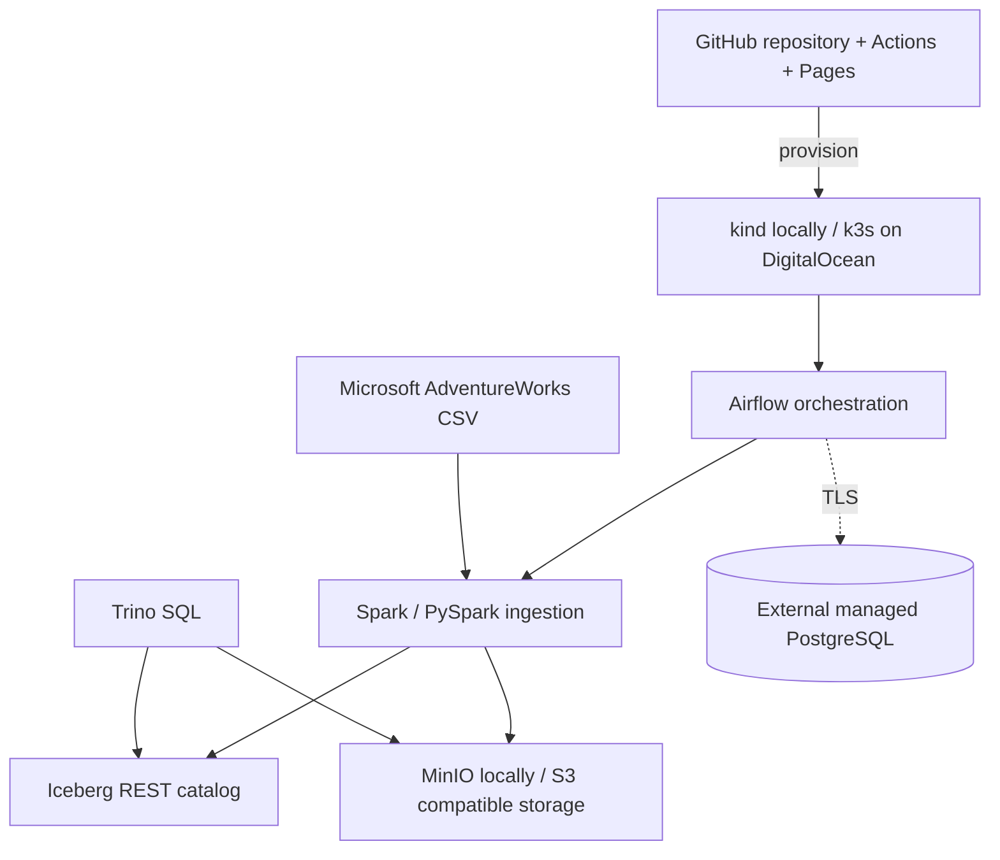

# Enterprise Iceberg Lakehouse Demo

A disposable, reproducible demonstration of an enterprise lakehouse using Apache Airflow, Apache Spark/PySpark, Apache Iceberg, MinIO/S3, Trino, Kubernetes, GitHub Actions, and GitHub Pages.

The project is designed for two modes:

- **Local:** a `kind` cluster on a developer workstation.
- **Client demo:** an ephemeral DigitalOcean Droplet running k3s, destroyed after the session.

Airflow metadata is stored in a separately managed PostgreSQL database. No database passwords, cloud tokens, or private keys belong in Git.

## Architecture



## Repository status

This initial scaffold provides:

- a kind bootstrap and idempotent deployment script;
- Kubernetes resources for MinIO, Iceberg REST, Trino, and a Spark ingestion job;
- the official Airflow Helm chart configured for an external PostgreSQL metadata secret;
- an AdventureWorks downloader pinned to Microsoft's official sample repository;
- a PySpark job that writes an Iceberg table and a Trino smoke query;
- a DigitalOcean Terraform scaffold with k3s cloud-init;
- CI checks and a static GitHub Pages architecture site.

## Prerequisites

Install Docker Desktop (or another Docker Engine), `kubectl`, `kind`, `helm`, Python 3.11+, and Git. The deploy script checks these before making changes.

## Local quick start

Deploy and verify the core data plane first. This generates the local MinIO password directly inside an untracked Kubernetes Secret:

```powershell
./scripts/deploy-core-local.ps1
./scripts/verify-core-local.ps1
```

Then configure Airflow with a dedicated managed-PostgreSQL database:

```powershell
Copy-Item .env.example .env
# Edit .env locally. AIRFLOW_METADATA_URL must point to a dedicated database/user.
./scripts/deploy-local.ps1
```

For PostgreSQL running in the Ubuntu WSL distribution, the included provisioning
script creates an isolated `airflow_demo` database and restricted owner, then
writes generated credentials to the ignored `.env` file without displaying them:

```powershell
wsl.exe -d Ubuntu -u root --cd "$PWD" -- bash -lc './scripts/provision-wsl-airflow-postgres.sh "$PWD"'
```

The script preserves an existing `.env`; pass `--rotate` explicitly to replace
the local credentials.

Rotate the local Airflow UI credential at any time without printing it:

```powershell
./scripts/rotate-local-airflow-admin.ps1
```

If local MinIO credentials are intentionally rotated, the deployment recreates
the disposable object-store pod and bootstrap job. Rerun the demo ingestion to
repopulate the sample lakehouse afterward.

Useful endpoints after deployment:

- Airflow: `http://127.0.0.1:18080`
- Trino: `http://localhost:8081`
- MinIO console: `http://localhost:9001`
- Iceberg REST catalog: `http://localhost:8181`

If port 18080 was not mapped when an older kind cluster was created, expose the
Airflow UI for the current session with:

```powershell
kubectl -n lakehouse port-forward service/airflow-api-server 18080:8080
```

Run the ingestion and query checks:

```powershell
./scripts/run-demo.ps1
```

The current local verification loaded 60,397 `FactInternetSales` rows into three Parquet data files, committed an Iceberg snapshot, and returned the same row count through Trino.

Destroy the disposable local environment:

```powershell
./scripts/destroy-local.ps1
```

## Managed PostgreSQL safety

Use a dedicated `airflow_db` database and least-privilege login, even when sharing an existing managed PostgreSQL cluster. Restrict trusted sources to the demo Droplet/VPC, require TLS, and remove access when the demo is destroyed. The deployment reads the full SQLAlchemy connection URL from the local environment and creates a Kubernetes Secret; it never writes the URL to a tracked values file.

## DigitalOcean

See [`infra/digitalocean/README.md`](infra/digitalocean/README.md). Terraform creates only the Droplet and firewall. k3s installs through cloud-init, then the same Kubernetes manifests are deployed. The Droplet must be destroyed—not merely powered off—to stop compute billing.

## Verification boundaries

CI performs static validation, Python tests, secret-pattern checks, and Terraform validation. A full cluster smoke test requires Docker/kind and is intentionally reported separately from static CI.

## License

Apache-2.0. AdventureWorks sample data remains governed by Microsoft's source repository terms.
