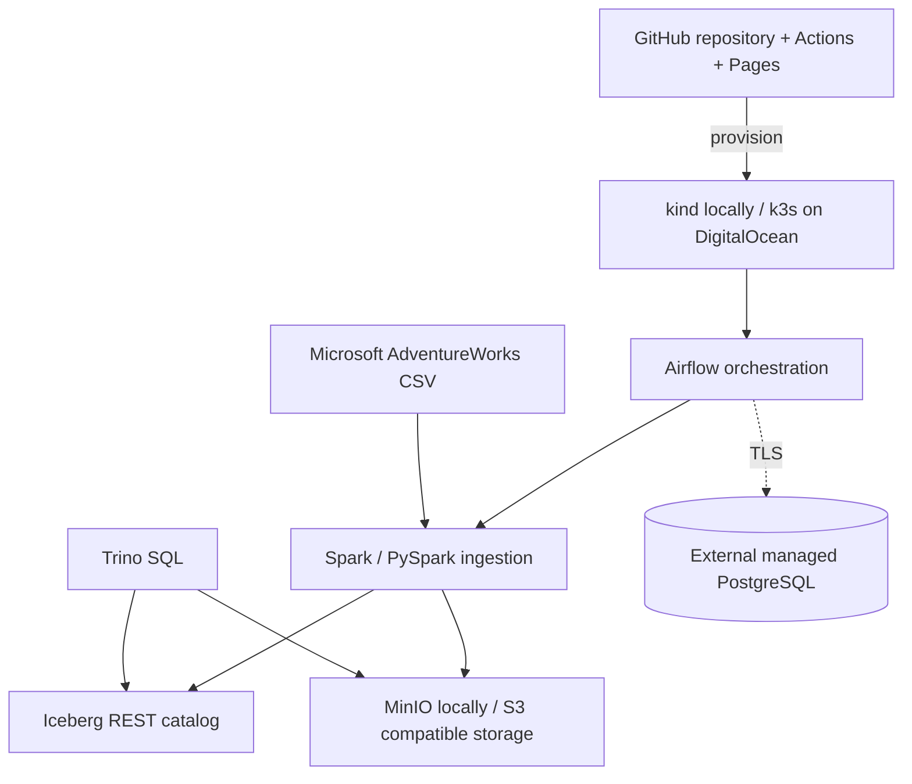

# Enterprise Iceberg Lakehouse Demo

A disposable, reproducible demonstration of an enterprise lakehouse using Apache Airflow, Apache Spark/PySpark, Apache Iceberg, MinIO/S3, Trino, Kubernetes, GitHub Actions, and GitHub Pages.

The project is designed for two modes:

- **Local:** a `kind` cluster on a developer workstation.
- **Client demo:** an ephemeral DigitalOcean Droplet running k3s, destroyed after the session.

Airflow metadata is stored in a separately managed PostgreSQL database. No database passwords, cloud tokens, or private keys belong in Git.

## Architecture



## Repository status

This initial scaffold provides:

- a kind bootstrap and idempotent deployment script;
- Kubernetes resources for MinIO, Iceberg REST, Trino, and a Spark ingestion job;
- the official Airflow Helm chart configured for an external PostgreSQL metadata secret;
- an AdventureWorks downloader pinned to Microsoft's official sample repository;
- a PySpark job that writes an Iceberg table and a Trino smoke query;
- a DigitalOcean Terraform scaffold with k3s cloud-init;
- CI checks and a static GitHub Pages architecture site.

## Prerequisites

Install Docker Desktop (or another Docker Engine), `kubectl`, `kind`, `helm`, Python 3.11+, and Git. The deploy script checks these before making changes.

## Local quick start

```powershell
Copy-Item .env.example .env
# Edit .env locally. AIRFLOW_METADATA_URL must point to a dedicated database/user.
./scripts/deploy-local.ps1
```

Useful endpoints after deployment:

- Airflow: `http://localhost:8080`
- Trino: `http://localhost:8081`
- MinIO console: `http://localhost:9001`
- Iceberg REST catalog: `http://localhost:8181`

Run the ingestion and query checks:

```powershell
./scripts/run-demo.ps1
```

Destroy the disposable local environment:

```powershell
./scripts/destroy-local.ps1
```

## Managed PostgreSQL safety

Use a dedicated `airflow_db` database and least-privilege login, even when sharing an existing managed PostgreSQL cluster. Restrict trusted sources to the demo Droplet/VPC, require TLS, and remove access when the demo is destroyed. The deployment reads the full SQLAlchemy connection URL from the local environment and creates a Kubernetes Secret; it never writes the URL to a tracked values file.

## DigitalOcean

See [`infra/digitalocean/README.md`](infra/digitalocean/README.md). Terraform creates only the Droplet and firewall. k3s installs through cloud-init, then the same Kubernetes manifests are deployed. The Droplet must be destroyed—not merely powered off—to stop compute billing.

## Verification boundaries

CI performs static validation, Python tests, secret-pattern checks, and Terraform validation. A full cluster smoke test requires Docker/kind and is intentionally reported separately from static CI.

## License

Apache-2.0. AdventureWorks sample data remains governed by Microsoft's source repository terms.

